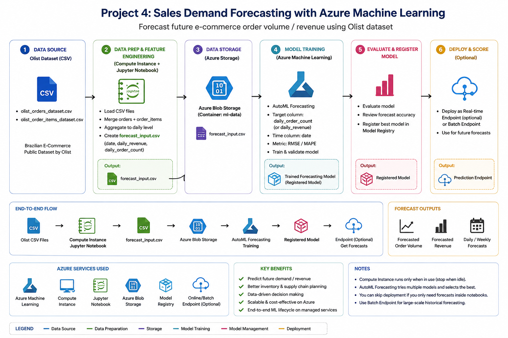
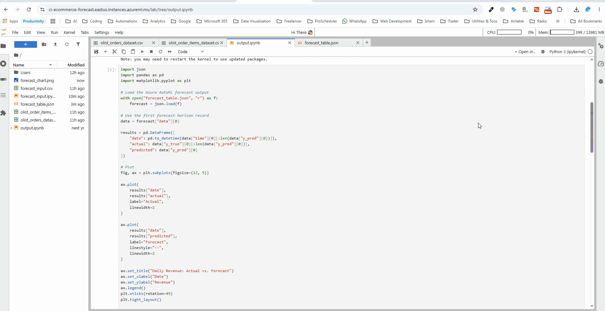

# E-Commerce Sales Demand Forecasting with Azure Machine Learning

A time-series forecasting project predicting daily e-commerce revenue using Azure Machine Learning's AutoML — moving beyond descriptive analytics (what happened) into predictive analytics (what's likely to happen next). Built as the fourth project in a series exploring different facets of the Azure data platform.





---

## 📌 Problem Statement

Understanding past sales trends is useful, but forecasting future demand is what lets a business actually plan — inventory, staffing, cash flow. This project trains a forecasting model on historical daily revenue from the Olist e-commerce dataset and uses Azure AutoML to automatically search across multiple forecasting algorithms, selecting the best-performing one for a 30-day-ahead revenue forecast.

---

## 🏗️ Approach

```
Raw order data → Daily revenue aggregation → Azure ML Data Asset
→ AutoML Forecasting Job (time-series validation) → Best model selection
→ Registered model → Forecast visualization
```

Rather than hand-picking a single algorithm, AutoML trained and evaluated multiple candidates (including ARIMA-family and ensemble methods) and automatically selected the best performer based on validation error — a practical demonstration of how AutoML accelerates model selection compared to manually building and tuning each algorithm.

---

## 🛠️ Tech Stack

| Component | Purpose |
|---|---|
| **Azure Machine Learning Workspace** | Manages compute, data assets, experiments, and model registry |
| **Azure ML Compute Instance** | Runs the AutoML training job |
| **Azure AutoML (Forecasting)** | Automatically trains and evaluates multiple time-series models |
| **Python (pandas)** | Data preparation — aggregating transaction-level data into a daily time series |
| **Azure ML Notebook** | Data prep and results analysis |

---

## 📊 Results

**Best Model:** ARIMAX (auto-selected by AutoML from multiple candidate algorithms)

| Metric | Score | What it means |
|---|---|---|
| **R²** | 0.9599 | The model explains ~96% of the variance in daily revenue — a strong fit |
| **Normalized RMSE** | 0.0212 | Very low relative prediction error |
| **MAPE** | 18.93% | Average forecast is off by ~19% in percentage terms — reasonable for daily-level e-commerce revenue, which is naturally noisy |
| **Explained Variance** | 0.9630 | Confirms the R² result — the model captures the vast majority of the signal in the data |

### Key Findings

- Azure AutoML selected **ARIMAX** as the best-performing model out of the algorithms it evaluated, balancing accuracy against the time-series structure of the data.
- With an R² of 0.96, the model captures the **overall revenue trend and daily sales patterns** effectively.
- **Prediction intervals widen over time** — the model is understandably more confident in short-term forecasts than in predictions further into the 30-day horizon, which is expected and correct behavior for a time-series model.
- MAPE of ~19% suggests day-to-day volatility that the model doesn't fully explain — likely driven by factors not present in this dataset (see limitations below).

### Limitations

- **Promotional events were not included** — sales spikes tied to promotions aren't explained by the model.
- **Holiday effects were not included** — a dedicated holiday calendar feature would likely reduce error around known high-traffic periods.
- **Marketing campaign data was unavailable** — campaign timing is a common driver of e-commerce demand that this model couldn't account for.
- Incorporating these as additional features would likely improve both R² and MAPE further.

---

## 🔁 How to Reproduce

1. **Provision an Azure ML workspace and compute instance** (see project write-up for CLI commands).
2. **Prepare the time series** — run [`scripts/prepare_forecast_data.py`](./scripts/prepare_forecast_data.py) to aggregate raw order data into a daily revenue series, producing `forecast_input.csv`.
3. **Register the data asset** in Azure ML Studio (Data → Create → upload `forecast_input.csv`).
4. **Run an AutoML forecasting job** — target column `daily_revenue`, time column `date`, forecast horizon `30`, using automatic time-series validation.
5. **Review results** in the job's Models tab, and register the best model.
6. **Analyze and visualize** — see [`notebooks/forecast_analysis.ipynb`](./notebooks/forecast_analysis.ipynb) for the full write-up and the actual/predicted chart.

> ⚠️ Remember to stop your compute instance between sessions — Azure ML compute bills hourly while running, whether or not a job is actively executing.

---

## 📂 Repo Structure

```
azure-ecommerce-demand-forecasting/
├── README.md
├── architecture-diagram.png
├── chart.gif
├── forecast_chart.png
├── mltraining1.gif
├── mltraining2.gif
├── scripts/
│   └── prepare_forecast_data.py
├── notebooks/
│   └── forecast_analysis.ipynb

```

---

## 💡 Next Steps / What I'd Do Differently at Scale

- **Add external features:** incorporate a holiday calendar, known promotional dates, and marketing campaign spend/timing as exogenous variables — ARIMAX specifically supports this and would likely see the biggest accuracy gain here.
- **Extend the forecast granularity:** break the single aggregate forecast into per-category or per-region forecasts for more actionable, localized planning.
- **Automate retraining:** wrap this into a recurring Azure ML pipeline that retrains on a schedule as new data arrives, rather than a one-off training run.
- **Deploy as an endpoint:** expose the registered model via a batch or real-time endpoint so forecasts could feed directly into a dashboard or downstream planning system.
- **Compare against a simple baseline:** validate AutoML's model choice against a naive baseline (e.g. seasonal naive or moving average) to quantify how much lift the ML model actually provides over a much simpler approach.

---

## 🔗 Related Projects

- **[Azure E-Commerce Analytics Pipeline](https://github.com/shijithpulikkal/azure-ecommerce-analytics-pipeline)** — batch ETL with ADF and Synapse serverless SQL
- **[Azure E-Commerce Streaming Pipeline](https://github.com/shijithpulikkal/azure-ecommerce-streaming-pipeline)** — real-time ingestion with Event Hubs and Stream Analytics
- **[Azure E-Commerce Dimensional Warehouse](https://github.com/shijithpulikkal/azure-ecommerce-dimensional-warehouse)** — star schema data modeling on Azure SQL Database

---


<!-- Add if relevant -->
